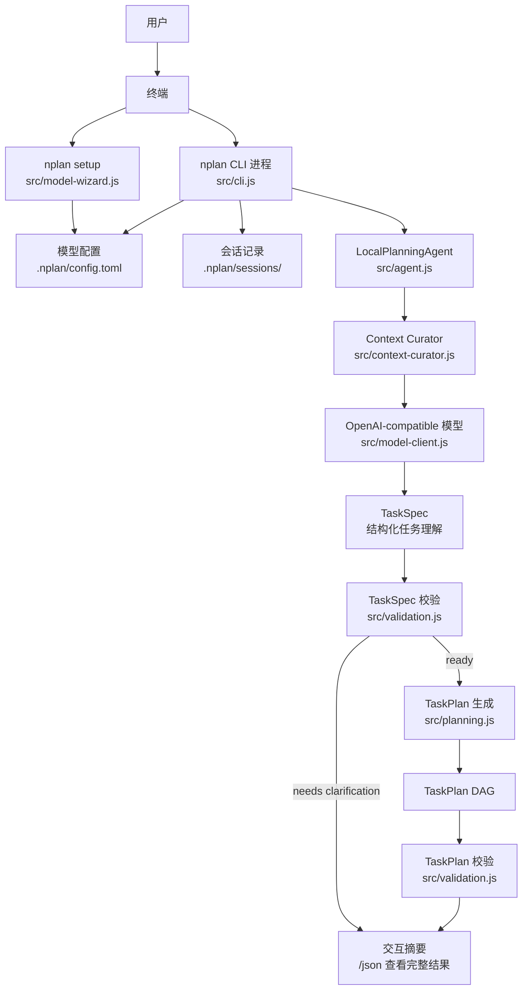
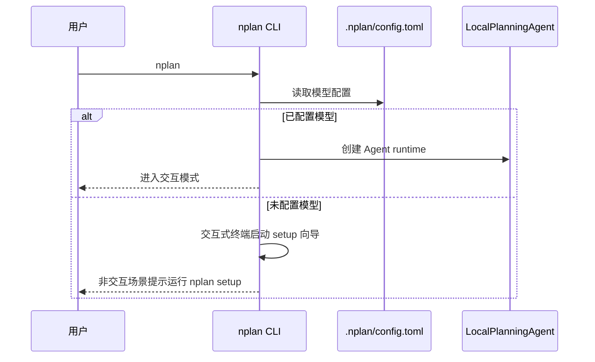
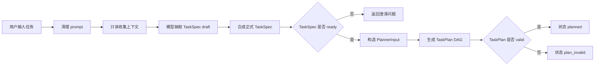
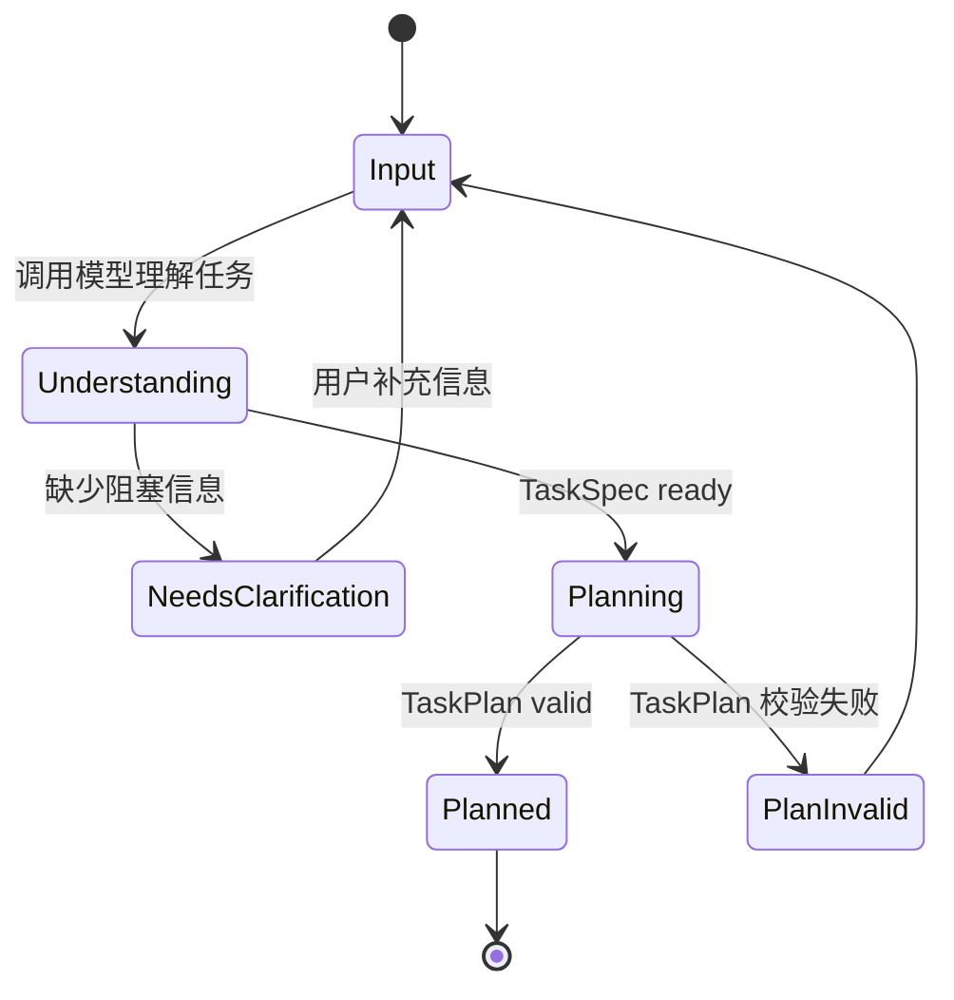

# NPlan 进程与任务使用说明

这份文档用于在 Obsidian 中阅读。Obsidian 可以直接渲染下面的 Mermaid 图，用来查看 NPlan 的启动流程、任务处理链路和主要模块关系。

## 适用场景

- 想知道执行 `nplan` 后内部发生了什么。
- 想区分“进程”和“任务”在本项目里的含义。
- 想用图形化方式查看 CLI、模型、上下文、`TaskSpec` 和 `TaskPlan` 的关系。

## 标准命令

安装：

```cmd
cd /d C:\Users\qiyue\Desktop\porgram\N_online_agent
install
```

之后打开任意 CMD，直接运行：

```cmd
nplan setup
nplan -p "设计一个本地文件整理工具，可以扫描文件、分类，并输出 Markdown 报告"
```

`nplan setup` 是推荐的用户配置入口。它会引导选择 Provider、输入 API Key、获取模型列表并写入 `.nplan/config.toml`。

如果首次在交互式终端运行 `nplan` 时还没有模型配置，CLI 会先启动同一个 setup 向导；非交互场景仍只提示运行 `nplan setup`。

## 核心概念

| 名称 | 含义 |
| --- | --- |
| 进程 | 用户执行 `nplan` 后启动的 Node.js CLI 进程，负责读取输入、加载配置、维持交互会话。 |
| 会话 | CLI 本地记录的规划交互摘要，位于 `.nplan/sessions/`，用于 `--continue` 和 `--resume`。 |
| 任务 | 用户输入的一段自然语言请求，例如“帮我设计文件整理工具”。任务不会被执行，只会被理解和拆分。 |
| TaskSpec | 对用户请求的结构化理解，包含目标、交付物、约束、缺失信息、风险和成功标准。 |
| TaskPlan | 从 `TaskSpec` 生成的有向无环任务图，包含任务输入、输出、依赖和验收标准。 |
| ContextPack | 只读收集到的项目上下文和证据包，供模型理解任务时参考。 |

## 总体结构图



## 启动流程



## 任务处理流程



## 交互方式

启动：

```cmd
nplan
nplan "帮我规划一个发布检查清单"
nplan -p "设计一个本地文件整理工具"
nplan exec "设计一个本地文件整理工具"
nplan --continue
nplan --resume <session-id>
nplan resume <session-id>
nplan doctor
```

进入后可以直接输入任务：

```text
nplan> 帮我设计一个本地文件整理工具，可以扫描文件、分类、输出报告
```

常用交互命令：

| 命令 | 作用 |
| --- | --- |
| `/help` | 查看命令帮助 |
| `/providers` | 查看内置模型 Provider |
| `/status` | 查看会话状态 |
| `/config`, `/settings` | 查看当前模型配置 |
| `/model [name]` | 查看或临时切换当前会话模型 |
| `/context` | 查看上一轮上下文整理摘要 |
| `/plan <prompt>` | 显式分析一个任务 |
| `/json` | 查看上一轮完整 JSON 结果 |
| `/compact [note]` | 压缩本地会话摘要 |
| `/clear`, `/reset`, `/new` | 清除上一轮结果并开启新会话 |
| `/continue` | 继续最近一次本地会话 |
| `/resume [id]` | 恢复指定或最近一次会话 |
| `/exit`, `/quit` | 退出进程 |

## 任务状态



| 状态 | 说明 |
| --- | --- |
| `needs_clarification` | 任务信息不够明确，只返回澄清问题，不生成 `TaskPlan`。 |
| `planned` | `TaskSpec` 和 `TaskPlan` 都通过校验，规划成功。 |
| `plan_invalid` | 已生成 `TaskPlan`，但校验失败，需要修正规划逻辑或输入。 |

## 边界

NPlan 只负责规划，不负责执行：

- 不执行 shell 命令。
- 不修改用户文件。
- 不部署、不发送、不购买、不提交。
- 不管理远程 Agent。
- 只在任务理解阶段调用已配置的模型 Provider。

## 文件入口

| 文件 | 作用 |
| --- | --- |
| `src/cli.js` | CLI 进程入口和交互循环 |
| `src/model-wizard.js` | `nplan setup` 引导式配置 |
| `src/agent.js` | Agent 主流程 |
| `src/context-curator.js` | 只读上下文整理 |
| `src/model-client.js` | OpenAI-compatible 模型调用 |
| `src/understanding.js` | TaskSpec 组合与规范化 |
| `src/planning.js` | TaskPlan DAG 生成 |
| `src/validation.js` | TaskSpec / TaskPlan 校验 |
| `.nplan/config.toml` | 项目模型配置 |
