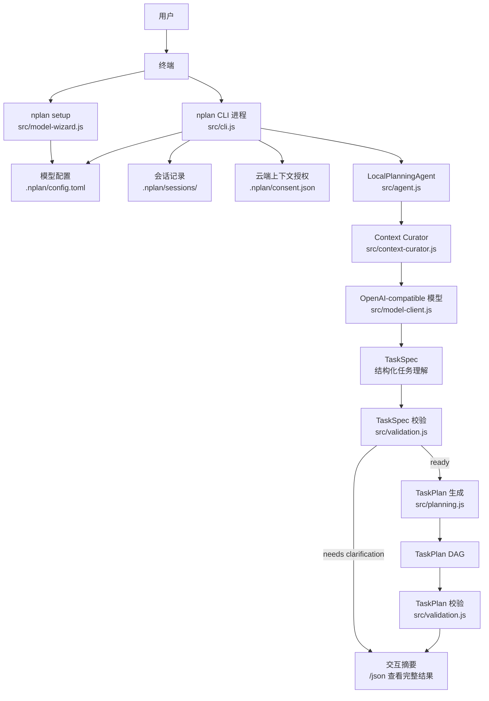
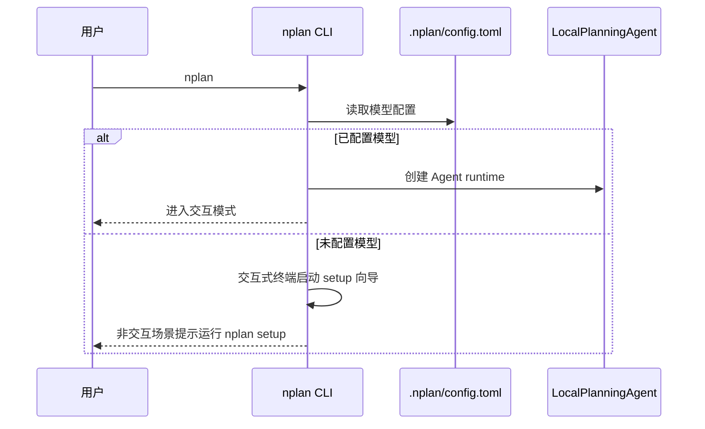
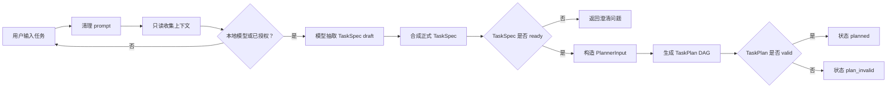
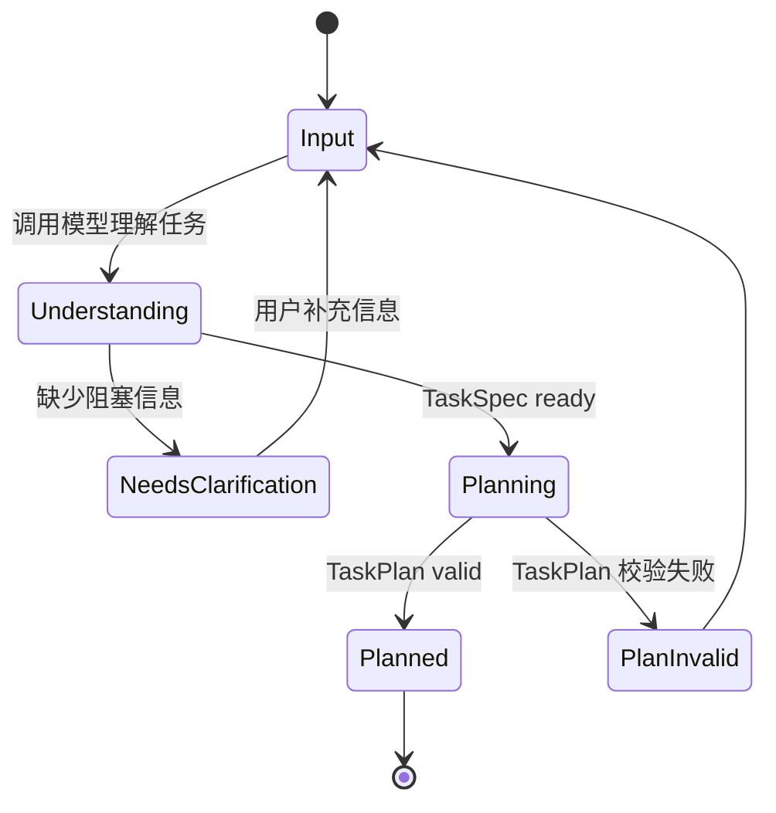

# NPlan 进程与任务使用说明

这份文档用于在 Obsidian 中阅读。Obsidian 可以直接渲染下面的 Mermaid 图，用来查看 NPlan 的启动流程、任务处理链路和主要模块关系。

## 适用场景

- 想知道执行 `nplan` 后内部发生了什么。
- 想区分“进程”和“任务”在本项目里的含义。
- 想用图形化方式查看 CLI、模型、上下文、`TaskSpec` 和 `TaskPlan` 的关系。

## 标准命令

安装：

```cmd
cd /d C:\Users\qiyue\Desktop\porgram\N_online_agent
install
```

之后打开任意 CMD，直接运行：

```cmd
nplan setup
nplan doctor
nplan doctor --online
nplan -p "设计一个本地文件整理工具，可以扫描文件、分类，并输出 Markdown 报告"
nplan consent status
```

`nplan setup` 是推荐的用户配置入口。它按推荐云端、本地、更多三组展示标准 Provider，以掩码方式读取 API Key，经用户确认后获取模型列表并写入 `.nplan/config.toml`；中文确认可直接输入“是”或“否”。向导展示 URL 时会移除用户名、密码、查询参数和片段，实际保存与请求值不变。

`nplan doctor` 只做本地配置、密钥和授权检查，不联网。`nplan doctor --online` 只允许向路径末段为 `models`、`health`、`healthz`、`status`、`ready` 或 `readiness`，且整条路径不含 chat、completions、responses、messages、embeddings 或 task(s) 段的只读地址发送一次 GET 探测；其他地址在零请求时拒绝。该探测不携带任务或本地上下文，也不会调用任务理解或计划接口。

如果首次在交互式终端运行 `nplan` 时还没有模型配置，CLI 会先启动同一个 setup 向导；非交互场景仍只提示运行 `nplan setup`。

## 核心概念

| 名称 | 含义 |
| --- | --- |
| 进程 | 用户执行 `nplan` 后启动的 Node.js CLI 进程，负责读取输入、加载配置、维持交互会话。 |
| 会话 | CLI 保存的净化版 session v2，位于 `.nplan/sessions/`，用于恢复最近结果与 WorkPlan；v1 明确不兼容。 |
| 任务 | 用户输入的一段自然语言请求，例如“帮我设计文件整理工具”。任务不会被执行，只会被理解和拆分。 |
| TaskSpec | 对用户请求的结构化理解，包含目标、交付物、约束、缺失信息、风险和成功标准。 |
| TaskPlan | 从 `TaskSpec` 生成的有向无环任务图，包含任务输入、输出、依赖和验收标准。 |
| ContextPack | 只读收集到的项目上下文和证据包，供模型理解任务时参考。 |

## 总体结构图



## 启动流程



## 任务处理流程



## 交互方式

启动：

```cmd
nplan
nplan "帮我规划一个发布检查清单"
nplan -p "设计一个本地文件整理工具"
nplan exec "设计一个本地文件整理工具"
nplan --lang en "Plan a release checklist"
nplan --continue
nplan --resume <session-id>
nplan resume <session-id>
nplan doctor
nplan doctor --online
nplan consent status
nplan consent revoke
nplan --allow-cloud-context -p "规划发布检查清单"
```

进入后可以直接输入任务：

```text
nplan> 帮我设计一个本地文件整理工具，可以扫描文件、分类、输出报告
```

常用交互命令：

| 命令 | 作用 |
| --- | --- |
| `/帮助` (`/help`) | 查看命令帮助 |
| `/服务商` (`/providers`) | 查看内置模型 Provider |
| `/状态` (`/status`) | 查看会话状态 |
| `/配置`, `/设置` | 查看当前模型配置 |
| `/模型 [名称]` | 查看或临时切换当前会话模型 |
| `/上下文` | 查看上一轮上下文摘要 |
| `/来源` | 查看上一轮来源 |
| `/步骤` | 查看上一轮行动步骤 |
| `/修改 <补充说明>` | 根据补充说明重新规划 |
| `/导出 [路径]` | 导出 Markdown WorkPlan |
| `/规划 <任务>` | 规划一个任务 |
| `/完整` | 查看上一轮完整 JSON 结果 |
| `/压缩 [备注]` | 压缩本地会话摘要 |
| `/清除`, `/重置`, `/新建` | 开启新会话 |
| `/继续` | 继续最近一次本地会话 |
| `/恢复 [会话编号]` | 恢复指定或最近一次会话 |
| `/退出`, `/结束` | 退出进程 |

界面默认使用简体中文。添加 `--lang en` 可切换为英文；英文斜杠命令始终兼容。

本地 Provider 不提示云端授权。云端 Provider 在第一次模型请求前先显示相对来源和预算，可查看来源、排除项目相对路径并重新整理上下文、记住当前范围，或取消。`--allow-cloud-context` 只对本次命令有效。非交互模式没有有效授权时以退出码 `2` 停止，且不会发送模型请求。`nplan consent status` 用于查看状态，`nplan consent revoke` 用于撤销。

恢复 session v2 时会立即恢复最近的 WorkPlan，因此 `/步骤`、`/来源` 和 `/导出` 可直接使用。会话文件不保存证据正文、来源内容、绝对路径、API Key 或 Authorization；保存的来源仅包含稳定 `source_id` 与项目相对路径。已有 WorkPlan 时直接输入文字或在 `--resume` 后附带文字都会按修订处理，`/新建` 清空该状态。

## 任务状态



| 状态 | 说明 |
| --- | --- |
| `needs_clarification` | 任务信息不够明确，只返回澄清问题，不生成 `TaskPlan`。 |
| `planned` | `TaskSpec` 和 `TaskPlan` 都通过校验，规划成功。 |
| `plan_invalid` | 已生成 `TaskPlan`，但校验失败，需要修正规划逻辑或输入。 |

## 边界

NPlan 只负责规划，不负责执行：

- 不执行 shell 命令。
- 仅在用户明确输入 `/导出` 时写出 WorkPlan；其他操作不修改用户文件。
- 不部署、不发送、不购买、不提交。
- 不管理远程 Agent。
- 规划流程只为 TaskSpec 理解和 TaskPlan 生成调用已配置的模型 Provider。
- setup 仅在用户确认后读取模型列表；`doctor --online` 仅在用户显式要求时执行一次白名单只读健康探测。
- 云端 Provider 未经当前范围授权时，不进行任何模型调用。

## 文件入口

| 文件 | 作用 |
| --- | --- |
| `src/cli.js` | CLI 进程入口和交互循环 |
| `src/session-store.js` | 原子保存和恢复净化版 session v2 |
| `src/consent.js` | 云端上下文范围指纹、预览和项目授权记录 |
| `src/model-wizard.js` | `nplan setup` 引导式配置 |
| `src/agent.js` | Agent 主流程 |
| `src/context-curator.js` | 只读上下文整理 |
| `src/model-client.js` | OpenAI-compatible 模型调用 |
| `src/model-errors.js` | Provider 错误分类、脱敏与下一步提示 |
| `src/understanding.js` | TaskSpec 组合与规范化 |
| `src/planning.js` | TaskPlan DAG 生成 |
| `src/validation.js` | TaskSpec / TaskPlan 校验 |
| `.nplan/config.toml` | 项目模型配置 |
