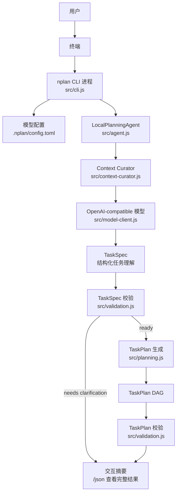
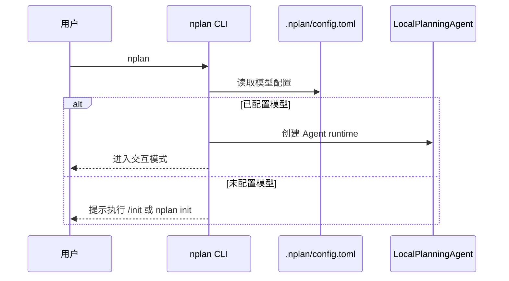
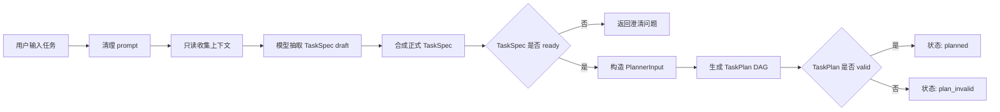
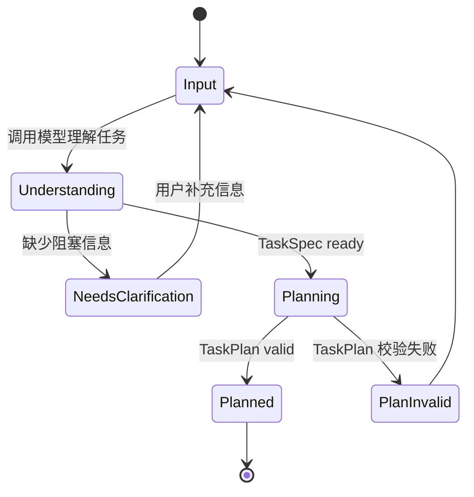

# NPlan 进程与任务使用说明

这份文档用于在 Obsidian 中阅读。Obsidian 可以直接渲染下面的 Mermaid 图，用来查看
NPlan 的启动进程、任务处理链路和主要模块关系。

## 适用场景

- 想知道 `nplan` 启动后内部发生了什么。
- 想区分“进程”和“任务”在本项目里的含义。
- 想用 Obsidian 图形化查看 CLI、模型、上下文、TaskSpec、TaskPlan 的关系。

## 核心概念

| 名称 | 含义 |
| --- | --- |
| 进程 | 用户执行 `nplan` 后启动的 Node.js CLI 进程。它负责读取输入、加载配置、维持交互会话。 |
| 任务 | 用户输入的一段自然语言请求，例如“帮我设计文件整理工具”。任务不会被执行，只会被理解和拆分。 |
| TaskSpec | 对用户请求的结构化理解，包含目标、交付物、约束、缺失信息、风险和成功标准。 |
| TaskPlan | 从 TaskSpec 生成的有向无环任务图，包含任务输入、输出、依赖和验收标准。 |
| ContextPack | 只读收集到的项目上下文和证据包，供模型理解任务时参考。 |

## 总体结构图



## 启动流程



## 任务处理流程



## 交互方式

启动：

```powershell
nplan
```

进入后可以直接输入任务：

```text
nplan> 帮我设计一个本地文件整理工具，可以扫描文件、分类、输出报告
```

常用命令：

| 命令 | 作用 |
| --- | --- |
| `/help` | 查看命令帮助 |
| `/providers` | 查看内置模型 Provider |
| `/init ollama qwen2.5` | 初始化本地模型配置 |
| `/status` | 查看会话状态 |
| `/plan <prompt>` | 显式分析一个任务 |
| `/json` | 查看上一轮完整 JSON 结果 |
| `/clear` | 清除上一轮结果 |
| `/exit` | 退出进程 |

## 任务状态



| 状态 | 说明 |
| --- | --- |
| `needs_clarification` | 任务信息不够明确，只返回澄清问题，不生成 TaskPlan。 |
| `planned` | TaskSpec 和 TaskPlan 都通过校验，规划成功。 |
| `plan_invalid` | 已生成 TaskPlan，但校验失败，需要修正规划逻辑或输入。 |

## 边界

NPlan 只负责规划，不负责执行：

- 不执行 shell 命令。
- 不修改用户文件。
- 不部署、不发送、不购买、不提交。
- 不管理远程 Agent。
- 只在任务理解阶段调用已配置的模型 Provider。

## 文件入口

| 文件 | 作用 |
| --- | --- |
| `src/cli.js` | CLI 进程入口和交互循环 |
| `src/agent.js` | Agent 主流程 |
| `src/context-curator.js` | 只读上下文整理 |
| `src/model-client.js` | OpenAI-compatible 模型调用 |
| `src/understanding.js` | TaskSpec 组合与规范化 |
| `src/planning.js` | TaskPlan DAG 生成 |
| `src/validation.js` | TaskSpec / TaskPlan 校验 |
| `.nplan/config.toml` | 项目模型配置 |
