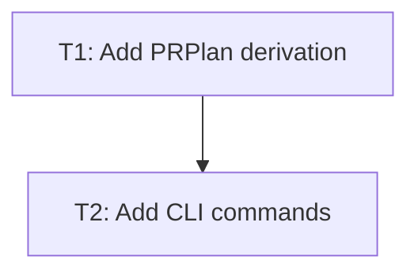

# Hybrid CLI PR Planning Design

## Summary

NPlan will improve its interactive CLI from a one-shot planning interface into a
guided local planning workspace. The first version keeps the existing
`TaskSpec`, `TaskPlan`, `ContextPack`, provenance, and validation contracts, then
adds a derived `PRPlan` view for command-line todos and Obsidian-friendly
Markdown export.

The product remains planning-only. It does not execute tasks, edit project
source files as part of the product behavior, create branches, open pull
requests, or run shell commands for the user. The only intentional write added
to product behavior is an explicit `/export` command that writes a planning
Markdown artifact after the user asks for it.

## Goals

- Make interactive mode feel guided while preserving free-form prompts and slash
  commands.
- Let users inspect the local context and evidence that shaped a plan.
- Generate and update a PR-oriented todo list from the latest planning result.
- Export a single Obsidian-friendly Markdown plan by default to a local draft
  location, with an optional user-provided path.
- Keep core planning artifacts stable by deriving `PRPlan` from existing
  planning results instead of overloading `TaskPlan`.

## Non-Goals

- No task execution, shell execution, source-file editing, git branch creation,
  pull request creation, browser automation, or remote-agent orchestration.
- No multi-file Obsidian vault export in the first version.
- No model-free fallback for semantic planning.
- No broad rewrite of the context curator or model provider system.

## User Flow

Interactive mode keeps the current direct input behavior:

```text
nplan
nplan> improve the CLI planning workflow
```

For each planning request, the CLI:

1. Curates local context through the existing context pipeline.
2. Produces and validates a `TaskSpec`.
3. If clarification is required, shows blocking questions and accepts either a
   direct answer or `/revise <additional context>`.
4. If the request is ready, produces and validates a `TaskPlan`.
5. Derives a `PRPlan` from the latest `TaskSpec`, `TaskPlan`, and context.
6. Prints a concise summary plus next-step commands.

The CLI remains command-driven when the user wants control:

```text
/context
/sources
/todo
/revise answer the blocking questions and keep scope to CLI commands
/export
/export docs/plans/cli-pr-plan.md
/json
```

## CLI Commands

### `/sources`

Shows the source and evidence details behind the latest result.

- If no result exists, print `No sources yet. Run /plan <prompt> first.`
- Show source id, kind, relative path, and a compact title or description.
- Show evidence id, source id, and an excerpt when available.
- Keep `/context` as the high-level summary and use `/sources` for detail.

### `/todo`

Shows the latest `PRPlan` todo list.

- If no result exists, print `No todo yet. Run /plan <prompt> first.`
- If clarification is still required, render the clarification questions as a
  small checklist instead of pretending a PR plan exists.
- For planned results, render checkboxes with task id, title, dependencies,
  outputs, and acceptance checks.

### `/revise <additional context>`

Replans from the latest session state plus user-supplied context.

- If no previous result exists, treat the argument as a normal planning prompt.
- If a previous result exists, build a new prompt from:
  - the latest surface request,
  - latest inferred goal,
  - latest clarification questions or plan summary,
  - the user's revision text.
- Run the normal analyze pipeline again and replace the latest result.
- Save the new turn in the existing session.

### `/export [path]`

Writes an Obsidian-friendly Markdown plan only when explicitly requested.

- Without `path`, write to `.nplan/exports/<plan-id>.md`.
- With `path`, write to the user-provided path.
- Create parent directories when needed.
- Refuse directory paths and non-Markdown extension surprises with clear errors.
- Never export if there is no latest result.
- If the latest result needs clarification, export a clarification-oriented note
  rather than a full PR plan.

## PRPlan

`PRPlan` is a derived view, not a replacement for `TaskPlan`.

Suggested shape:

```js
{
  version: '1.0',
  plan_id: '20260708-hybrid-cli-pr-plan',
  session_id: '20260708220500-abcd1234',
  status: 'planned',
  goal: 'Improve the CLI planning workflow',
  todo_items: [],
  task_links: [],
  source_links: [],
  verification_steps: [],
  pr_draft: {
    title: 'Improve NPlan interactive PR planning',
    summary: [],
    testing: []
  },
  obsidian: {
    title: 'PR Plan: Improve NPlan interactive PR planning',
    tags: ['nplan', 'pr-plan'],
    task_aliases: [],
    mermaid: 'flowchart TD\n  T1["T1: Add PRPlan derivation"]'
  }
}
```

Rules:

- `plan_id` is stable for the latest result and safe for filenames.
- `todo_items` are derived from `taskplan.tasks`.
- `verification_steps` come from task acceptance checks and global acceptance.
- `source_links` come from `taskspec.source_map` and `taskspec.evidence_map`.
- `pr_draft` is a planning draft only. It is not submitted anywhere.
- For clarification results, `PRPlan` can contain clarification todos and no
  task graph.

## Obsidian Markdown Export

The first version exports one Markdown file. It should be readable in any
Markdown viewer and more useful in Obsidian.

Template:

````markdown
---
type: nplan-pr-plan
plan_id: 20260708-hybrid-cli-pr-plan
session_id: 20260708220500-abcd1234
status: planned
tags:
  - nplan
  - pr-plan
---

# PR Plan: Improve NPlan interactive PR planning

## Summary

## Todo

- [ ] T1 Add PRPlan derivation

## Task Graph



## Tasks

### [[Task T1 - Name]]

## Sources

## Evidence

## Verification Plan

## PR Draft

## Raw IDs
````

The single-file export uses stable headings and Obsidian links such as
`[[Task T1 - Name]]` so a later version can split tasks into separate files
without changing the mental model.

## Validation And Error Handling

- `PRPlan` derivation should validate that todo items have ids, titles, source
  task ids, and non-empty acceptance or clarification text.
- `/todo`, `/sources`, and `/export` must handle missing latest results.
- `/export` must surface write errors without losing the in-memory session.
- Export paths should be resolved from the current project root unless the user
  provides an absolute path.
- Generated Markdown should escape characters that would break Mermaid node
  labels or YAML frontmatter.

## Files To Change

- `src/pr-plan.js`: derive and validate `PRPlan`, render todo text, render
  Obsidian Markdown.
- `src/cli.js`: add `/sources`, `/todo`, `/revise`, `/export`, store latest
  derived `PRPlan`, and update help text.
- `src/index.js`: export PR planning helpers if useful for library users.
- `test/cli.test.js`: cover new interactive commands and export behavior.
- `test/pr-plan.test.js`: cover derivation, validation, Mermaid, and Markdown
  rendering.
- `README.md`, `README.zh-CN.md`, and `docs/agent-module-spec.md`: document the
  new CLI commands and the explicit export boundary.

## Test Plan

- Run `node --test`.
- Run `node --check src/cli.js`.
- Run `node --check src/pr-plan.js`.
- Add focused tests for:
  - `/sources` after a planned result,
  - `/todo` after a planned result,
  - `/todo` after a clarification result,
  - `/revise` with and without a previous result,
  - `/export` defaulting to `.nplan/exports/`,
  - `/export <path>` writing a user path,
  - Obsidian Markdown containing frontmatter, todo checkboxes, Mermaid graph,
    wiki links, sources, verification plan, and PR draft.

## Open Decisions Resolved

- Interaction style: hybrid guided CLI.
- Persistence: sessions by default, explicit Markdown export only.
- Export format: one Obsidian-friendly Markdown file in the first version.
- Default export path: `.nplan/exports/`, with optional path override.
- Planning view: derived `PRPlan`, leaving core `TaskPlan` stable.
- Clarification flow: show questions and allow either direct answers or
  `/revise`.
